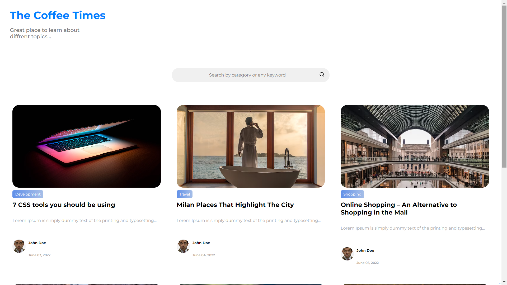

# React frontend for WP Blog

This is a react frontend for wordpress blog, based on the wordpress rest 

## Available Scripts

In the project directory, you can run:

### `npm start`

Runs the app in the development mode.\
Open [http://localhost:3000](http://localhost:3000) to view it in your browser.

The page will reload when you make changes.\
You may also see any lint errors in the console.

### `npm install`

Run the cmd to install all the dependencies.

### `npx json-server --watch -p3333 Data/BlogsDb.json`

To start the jason server, and make sure it runs on this port 3333.

### `npm start`
To start the npm server.

Project snapshots-

1) Home Page
 

  

