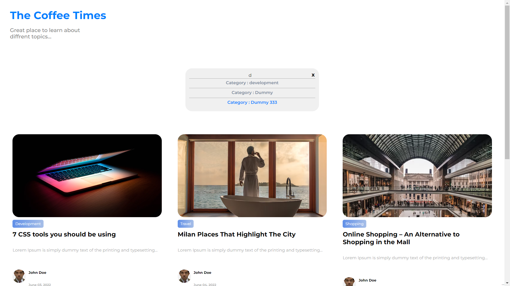
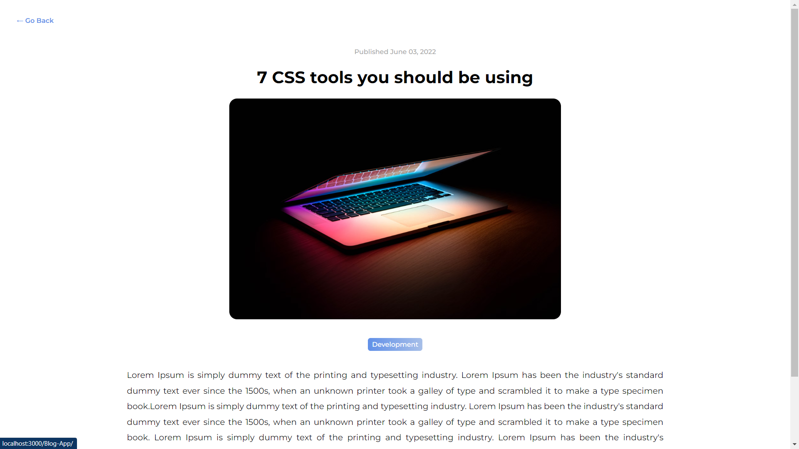
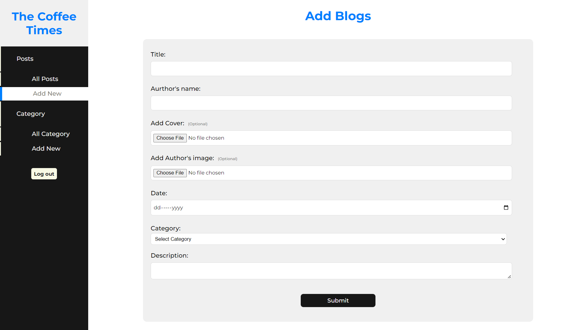

# React frontend for WP Blog

This is a react frontend for wordpress blog, based on the wordpress rest 

## Available Scripts

In the project directory, you can run:

### `npm start`

Runs the app in the development mode.\
Open [http://localhost:3000] to view it in your browser.

### `npm install`

Run the cmd to install all the dependencies.

### `npm run json-server`

To start the Json server.

### `npm start`
To start the npm server.

Project snapshots-

1) Home Page.
 

  

2) Category dropdown suggestions.

  

3) Search Results.

  

4) A Detail Page.

  

Now Let's come back to the home page  
5) A Load more feature.

  

6) When there will be no content to show.

  

7) Admin Login  
To access the Admin login page use /admin.

  

8) Admin pannel  
Where the admin can perform CRUD operations.

  

 
A Preview page for the admin.

  

 
Where the admin can delete post.

  

 

A page where the admin can create a new post.

  

 

A page where the can can view their added categories.

  

